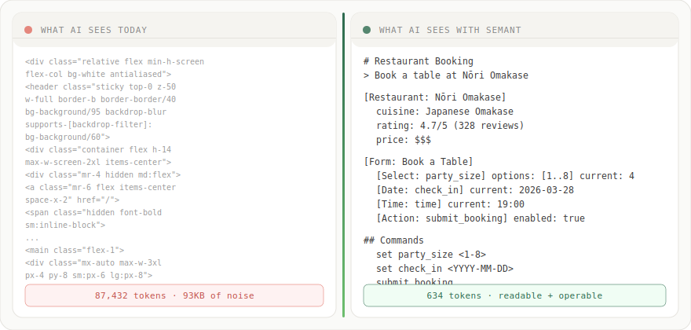
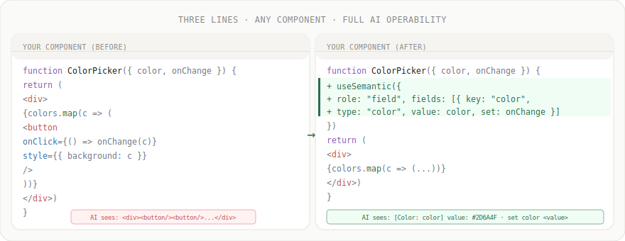
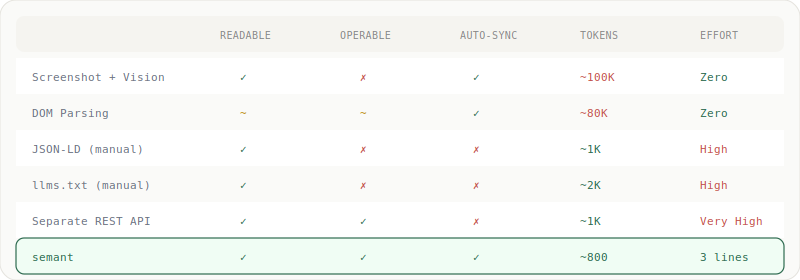

# semant

**Components that describe themselves to AI.**

Build pages that are human-beautiful and machine-operable. Every component knows how to render itself *and* how to explain itself — as plain text, llms.txt, JSON-LD, or MCP tools. No separate metadata layer. No reverse engineering. One source of truth.

[](https://www.npmjs.com/package/semant) [](LICENSE) · [Live Demo](https://waynewangyuxuan.github.io/Semant/)

---

<p align="center">
  
</p>

---

## The Problem

AI agents trying to understand a web page today have two options:

1. **Screenshot + vision model** — slow, expensive, imprecise
2. **Parse the DOM** — a wall of nested `<div class="btn-primary mx-2 shadow-lg">` tells you nothing

Both are reverse engineering. The page was never designed to be understood.

## The Idea

What if components described themselves?

```tsx
// A normal select. AI sees: <div><select>...</select></div>
<select value={size} onChange={setSize}>
  <option>1</option>
  <option>2</option>
</select>

// A semant select. AI sees:
// [Select: party_size] options: [1, 2, 3, 4] current: 2
// Command: set party_size <1|2|3|4>
<SemanticSelect
  name="party_size"
  label="Party Size"
  options={[
    { value: 1, label: "1" },
    { value: 2, label: "2" },
    { value: 3, label: "3" },
    { value: 4, label: "4" },
  ]}
  value={size}
  onChange={setSize}
/>
```

Same UI for humans. But now AI can read the page, understand the state, and operate it — with zero vision models, zero DOM parsing.

## Framework Support

| Framework | Package | Status |
|-----------|---------|--------|
| React 18+ | `@semant/react` | Full support, SSR-safe |
| Vue 3.3+ | `@semant/vue` | Full support, SSR-safe |
| Svelte | — | Planned |

All adapters share `@semant/core` (pure JS, zero dependencies) and expose identical semantic state through the same four output channels.

## Quick Start

### React

```bash
npm install @semant/react
```

```tsx
import {
  SemanticProvider,
  SemanticSelect,
  SemanticAction,
  SemanticInfo,
  SemanticHead,
  SemanticBridge,
} from "@semant/react";

function App() {
  const [size, setSize] = useState(2);

  return (
    <SemanticProvider title="Restaurant Booking" description="Book a table at Nori">
      <SemanticHead baseUrl="https://mysite.com" />
      <SemanticBridge />

      <SemanticInfo
        role="restaurant"
        title="Nori Omakase"
        meta={{ cuisine: "Japanese", rating: 4.7, price: "$$$" }}
      >
        <h1>Nori Omakase</h1>
        <p>Japanese &middot; $$$</p>
      </SemanticInfo>

      <SemanticSelect
        name="party_size"
        label="Party Size"
        options={[1, 2, 3, 4, 5, 6].map((n) => ({ value: n, label: String(n) }))}
        value={size}
        onChange={setSize}
      />

      <SemanticAction
        name="submit_booking"
        label="Book Table"
        onExecute={() => alert("Booked!")}
        enabled={size > 0}
        requires={["party_size", "date", "time"]}
      />
    </SemanticProvider>
  );
}
```

### Vue

```bash
npm install @semant/vue
```

```vue
<script setup>
import { ref } from "vue";
import {
  SemanticProvider,
  SemanticSelect,
  SemanticAction,
  SemanticBridge,
} from "@semant/vue";

const size = ref(2);
const options = [1, 2, 3, 4].map((n) => ({ value: n, label: String(n) }));
</script>

<template>
  <SemanticProvider title="Restaurant Booking">
    <SemanticBridge />
    <SemanticSelect
      name="party_size"
      label="Party Size"
      :options="options"
      :value="size"
      @change="size = $event"
    />
    <SemanticAction
      name="submit_booking"
      label="Book Table"
      :on-execute="() => alert('Booked!')"
      :enabled="size > 0"
    />
  </SemanticProvider>
</template>
```

Two extra lines (`<SemanticHead>` and `<SemanticBridge>`) and your page is now AI-readable through four channels simultaneously.

## How AI Reads Your Page

Semant exposes your page state through four channels. You don't need to pick — `<SemanticHead>` and `<SemanticBridge>` enable all of them at once.

<p align="center">
  
</p>

### 1. JSON-LD in `<head>` (search engines, AI Overview)

`<SemanticHead>` automatically injects a `<script type="application/ld+json">` tag with Schema.org structured data. Google, Bing, and AI Overview can parse it. Updates automatically when state changes.

### 2. llms.txt (AI crawlers)

Use `toLlmsTxt()` to generate [llms.txt](https://llmstxt.org)-compatible output and serve it at `yoursite.com/llms.txt`. Perplexity, Claude, and 600+ sites already use this convention.

```ts
import { toLlmsTxt } from "@semant/core";
const content = toLlmsTxt(page, { baseUrl: "https://mysite.com" });
// Serve as /llms.txt
```

### 3. Hidden DOM node (browser agents)

`<SemanticBridge>` renders a hidden `<div id="__semant">` with a plain-text description of the page. Browser agents (Claude in Chrome, Operator, etc.) can read it directly from the DOM instead of parsing the entire page.

### 4. Global JS API (the most powerful path)

`<SemanticBridge>` also exposes `window.__semant` — a full read/write API:

```javascript
// Read the current page state
__semant.getState()
// Returns plain text like:
// [Select: party_size] options: [1, 2, 3, 4, 5, 6] current: 2
// [Action: submit_booking] enabled: true

// Execute a command and get the updated state in one step
const { ok, state } = await __semant.execute("set party_size 4")
// ok: true
// state: "...party_size current: 4..."

// Trigger an action
await __semant.execute("submit_booking")
```

`execute()` returns a Promise that resolves after the framework has re-rendered, so the `state` in the response is always up-to-date.

## API

### Provider & Hooks

| Export | React | Vue | Description |
|--------|-------|-----|-------------|
| `SemanticProvider` | component | component | Wrap your app. Sets page title/description. |
| `useSemantic(options)` | hook | composable | Register any component as a semantic node. |
| `useSemanticPage()` | hook | composable | Read the full semantic state. Re-renders on changes. |
| `useSemanticStore()` | hook | composable | Get the store directly for executing commands. |

### AI Delivery

| Export | Description |
|--------|-------------|
| `<SemanticHead>` | Injects JSON-LD `<script>` into `<head>`. Auto-updates. |
| `<SemanticBridge>` | Hidden DOM node + `window.__semant` global API. |

### Output Renderers

| Export | Description |
|--------|-------------|
| `toPlainText(page)` | AI-readable plain text with commands |
| `toLlmsTxt(page, options?)` | [llms.txt](https://llmstxt.org) spec-compatible output |
| `toJsonLd(page, options?)` | Schema.org JSON-LD structured data |
| `toJsonLdScript(page, options?)` | JSON-LD as string for `<script>` embedding |
| `toMCPTools(page, options?)` | MCP tool definitions for AI agent discovery |
| `toHeadHtml(page, options?)` | Raw `<meta>` + JSON-LD HTML for SSR injection |

### Reference Components

These are optional — use them directly, or use `useSemantic` to make your own.

| Component | Type | Description |
|-----------|------|-------------|
| `SemanticSelect` | select | Dropdown / option picker |
| `SemanticDatePicker` | date | Date selector with min/max |
| `SemanticTextInput` | text | Text / email / number input |
| `SemanticTextarea` | textarea | Multiline text input |
| `SemanticCheckbox` | checkbox | Boolean toggle |
| `SemanticSlider` | slider | Range input with min/max/step |
| `SemanticRadioGroup` | radio | Single choice from options |
| `SemanticMultiSelect` | multi-select | Multiple selection from options |
| `SemanticAction` | action | Button / submit action |
| `SemanticInfo` | (any role) | Static info block (restaurant details, product specs) |
| `SemanticList` | List | List of items with metadata |

All components support custom rendering via `children` render prop (React) or scoped slots (Vue). `SemanticAction` uses a `render` prop (React) or `render` slot (Vue) since `children`/default slot is used for button content.

## SSR Support

Both adapters are SSR-safe and work with Next.js, Nuxt, and other SSR frameworks. During server rendering:

- Nodes register synchronously so `<SemanticHead>` outputs populated JSON-LD
- `<SemanticBridge>` renders the hidden div with semantic state (the `window.__semant` API activates on the client)
- `toHeadHtml()` provides a pure function for programmatic head injection:

```ts
import { SemanticStore, toHeadHtml } from "@semant/core";

// In your SSR handler
const store = new SemanticStore();
store.setPage("My App");
// ... register nodes
const headHtml = toHeadHtml(store.getSnapshot(), { baseUrl: "https://mysite.com" });
// Inject into <head>
```

## MCP Integration

`@semant/mcp` provides an MCP server that bridges your semantic page state to AI agents:

```ts
import { createSemantMCPServer } from "@semant/mcp";

const { server, connectStdio } = createSemantMCPServer(store);
await connectStdio(); // AI agents can now discover and call your page's fields as tools
```

## Make Your Own Components Semantic

The reference components are just examples. The real power is `useSemantic`:

<p align="center">
  
</p>

```tsx
import { useSemantic } from "@semant/react"; // or "@semant/vue"

function MyFancyColorPicker({ color, onChange }) {
  useSemantic({
    role: "Field",
    title: "Color Picker",
    fields: [
      {
        key: "color",
        label: "Selected Color",
        type: "color-picker",  // any string works, not limited to built-in types
        value: color,
        constraints: { options: ["red", "blue", "green", "yellow"] },
        set: (v) => onChange(v),
      },
    ],
  });

  // Your beautiful custom UI here
  return <div>...</div>;
}
```

Three lines of integration. Your component is now self-describing and AI-operable.

<p align="center">
  
</p>

## Packages

| Package | Description |
|---------|-------------|
| `@semant/core` | Store, types, output renderers — pure JS, zero dependencies |
| `@semant/react` | React 18+ adapter — hooks, provider, 13 reference components |
| `@semant/vue` | Vue 3.3+ adapter — composables, provider, 13 reference components |
| `@semant/mcp` | MCP server bridge for AI agent tool discovery |
| `semant` | Convenience package — re-exports `@semant/react` |

## Philosophy

The web was built for human eyes. AI understands it through reverse engineering — parsing DOMs, taking screenshots, guessing what buttons do.

`llms.txt` made the web **readable** to AI. semant makes it **operable**.

Every component carries its own documentation. Not as an afterthought, not as a separate metadata layer, but as a first-class output generated from the same state that renders the UI.

The page *is* its own API.

## Contributing

PRs welcome for:

- Framework adapters (Svelte, vanilla JS)
- More reference components
- Better docs
- SSR framework guides (Next.js, Nuxt)

## License

MIT
